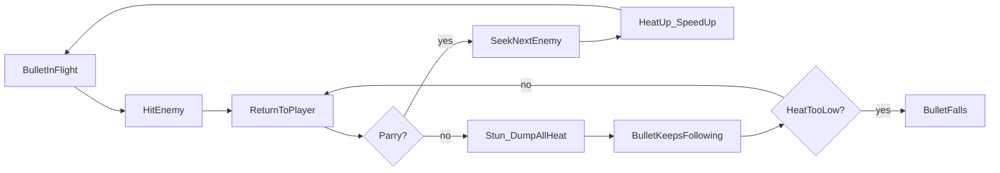

# WORKING TITLE — Design Bible

Solo 2D action game for Steam. One-feature focus. Engine: **Godot 4**.

**Pitch:** One bullet. Parry it back. Heat makes you and the bullet faster.

Not a walking sim. Not co-op for v1. Not a mobile-style level picker.

---

## 1. Core loop

What the player does every few seconds:

1. Bullet is in flight toward an enemy.
2. Bullet hits enemy → **auto-returns** to the player.
3. Player **parries** on return → bullet **fake-seeks** the next valid enemy.
4. Successful parry → **heat up** → bullet and player **speed up**.
5. Missed parry → **stun** + **lose all heat** (see §3).

### Locked rules

- The player has **exactly one bullet**. No second gun. Ever (v1).
- On enemy hit, the bullet **always returns** to the player.
- On successful parry, the bullet redirects via **authored/fake seek** (straight flight to target).
- **Player move speed is tied to bullet speed** (including when the bullet is forced to crawl around geometry — see grappling).
- The **heat meter** is the readable expression of that shared speed state.
- Vertical / blocked traversal uses a **grappling hook**; bringing the bullet along is heavily encouraged.

---

## 2. Targeting (locked)

Angles are **fake**, not physics reflection.

| Rule | v1 behavior |
| --- | --- |
| Path | Bullet flies straight to the chosen/valid target |
| After parry seek | Next enemy in facing cone, else nearest valid target |
| Multi-bounce | Locked behind later unlocks (e.g. hop through a second enemy before returning) |
| Unlocks change | *What* can be chained / prioritized — **not** real ricochet math |

Player agency on redirect (keep this):

- Early parry → safer, nearest / easiest target.
- Late parry + facing → riskier, marked / far / elite target.

If seek has zero player input forever, the game collapses into pure rhythm with no aim identity.

---

## 3. Heat and speed

### Locked

- Heat rises on each successful parry in a chain.
- Higher heat = faster bullet + faster player.
- Heat is always visible (UI meter + bullet/player feedback).
- **Heat decays over time while the player is not parrying.**
- On **missed parry**: player is **stunned** and **heat dumps to zero**.
- After a miss (and in general): the bullet **keeps following** the player regardless of heat, until speed/heat is so low that the bullet **falls** (rally ends; pick-up / restart rules TBD in prototype).

### Why this combo

- Decay = intentional pacing without a second meter.
- Miss punish = readable (stun) + full heat loss, without instant death.
- Follow-until-fall keeps the one-bullet fantasy alive after a miss instead of deleting the projectile.

---

## 4. Grappling hook & bullet carry (locked)

Used when the player must clear geometry the rally cannot fly straight through (example: a **vertical wall**).

### How it works

1. Player grapples (e.g. hooks the **ceiling** / anchor) to swing or pull past the obstacle.
2. **Best play:** also hook / latch the **bullet** so it travels with you past the wall. Momentum and heat stay hot; you stay fast.
3. **If you leave the bullet behind:** you still clear the wall, but the bullet must **path around** the obstacle (fake path along/around the wall). While pathing around it **bleeds momentum** and moves slowly.
4. Because **player speed is tied to bullet speed**, a crawling bullet makes **you** slow too. Crossing without the bullet is possible but heavily punished by pace.

### Design intent

- Grapple is traversal, not a second combat system.
- Separation from the bullet is a readable mistake: you feel the speed die as the bullet crawls the long way.
- Levels can place walls/anchors that teach “hook yourself **and** the bullet.”

### Notes

- Bullet path-around uses the same **fake pathing** philosophy as combat seek (authored route, not real physics bounce).
- Exact input for “hook the bullet too” can be tuned in prototype (same hook catches nearby bullet vs dedicated latch) — fantasy is locked.

---

## 5. World and progression (locked)

### Structure

- **Multiple discrete 2D levels** (arenas/stages), not one giant continuous map.
- Level select lives in a **hub** the player walks through.
- Hub exits are **doors / holes / gates** with **seamless transitions** into levels.
- Returning from a level drops the player back into the hub near that exit.

### Anti-goal

No Candy Crush / mobile node-map level select. No grid of locked icons as the primary fantasy.

### Hub role

- Traversal + portal fantasy.
- Each door leads to a **self-contained** arena built for instant retry.
- Later (not v1 prototype scope): unlocks such as bounce skills or target filters can be gated by hub progress.

---

## 6. Controls (prototype)

- **Keyboard only** for now.
- Basic bindings only: move, parry, start rally / fire, grapple (when that slice starts).
- Controller support is deferred until the loop feels good.

---

## 7. Level design principles

- Short arenas built around **rally readability** as heat rises.
- Bullet must stay fat/readable; strong audio cue on return; next target should be marked or flashed.
- Instant restart on fail.
- Clear room objective (examples: clear enemies / survive a heat threshold / reach exit).
- First three levels teach only: **fire → return → parry → heat → wipe**.
- Later arenas introduce a **wall + grapple** beat that teaches: leave the bullet → slow crawl around; hook it with you → keep speed.

---

## 8. Out of scope for v1

- Online co-op / P2P / Steam lobbies
- Real bullet physics angles / ricochet simulation
- Large open 2D world / Metroidvania map
- Feature pile-ons unrelated to the rally (inventory RPG, crafting, dialogue trees, etc.)
- Controller / full rebind UI (until after keyboard loop is solid)

---

## 9. Open questions

Track here until locked:

1. Exact **stun duration** and whether you can still move slightly while stunned.
2. Exact **fall threshold** (heat/speed value) and how the player recovers the fallen bullet.
3. **Camera behavior at high heat** — keep readable without nausea.
4. **Hub art metaphor** — doors vs holes vs gates (function is locked; flavor is not).
5. **Grapple + bullet latch input** — one hook that auto-grabs nearby bullet vs explicit second latch.
6. Working title / Steam page fantasy name.
7. **Dev ownership split** — decide when we start coding (not blocking design).

---

## 10. Art direction (placeholder)

- Prototype with simple shapes / solid colors first.
- Prefer **vector-style / crisp 2D** (sprites, polygons, or SVG-like assets) over pixel art — Godot handles non-pixel 2D fine; no engine reason to go pixel.
- Pixel art is optional later only if we choose that look on purpose.

---

## 11. Prototype checklist (vertical slice)

Validate the fantasy before building content:

1. Player + one bullet + one enemy type.
2. Hit → return → parry → fake seek to next enemy.
3. Heat meter tied to shared bullet/player speed; decay while not parrying; miss = stun + dump heat; bullet follows until too slow and falls.
4. One arena + instant restart.
5. Tiny hub with two doors into two levels (seamless transition stub).
6. **Second slice:** one vertical wall + grapple; leaving the bullet forces slow path-around (player slows); latching the bullet keeps momentum.

Ship the loop when retrying one arena fifty times still feels good. Only then add hub polish, unlocks, and more stages.
